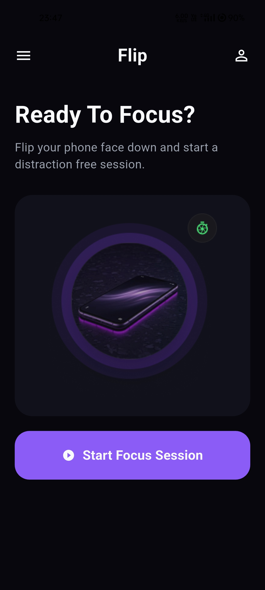
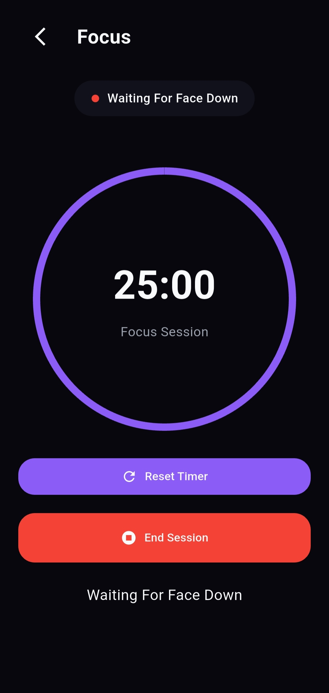
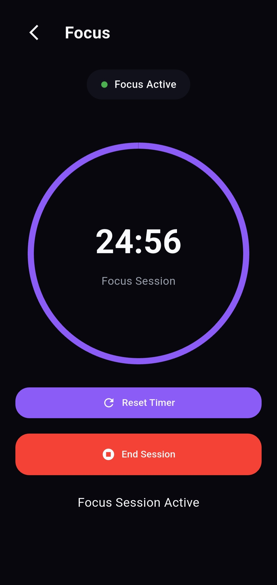

<div align="center">


# 🔄 Flip

### Flip your phone. Focus instantly.

*A native-powered Flutter app that starts a distraction-free focus session the moment you place your phone face down — no taps, no setup, no excuses.*

[](https://flutter.dev)
[](https://kotlinlang.org)
[](https://developer.android.com)
[](#license)

</div>

---

## 💡 Why Flip?

Every focus app on the Play Store makes you do the same tedious ritual before you can actually focus:

1. Open the app
2. Manually start a timer
3. Manually enable Do Not Disturb
4. Manually pick some ambient noise
5. *Then*, finally, focus

That's five decisions standing between you and doing the work — and each one is a chance to get distracted before you even start.

**Flip removes all five.** You flip your phone face down. That's it. Detection, Do Not Disturb, the timer, and ambient sound all kick in automatically, driven entirely by native Android sensors and services — not a polling loop, not a background hack, an actual persistent Foreground Service.

---

## ⚙️ How It Works

```
Flutter UI
    │
    ▼
MethodChannel  (Dart ⇄ Kotlin bridge)
    │
    ▼
Native Android Layer
    │
    ├── Foreground Service ── keeps Flip alive even if the Flutter UI is killed
    │
    ├── Sensor Manager ── fuses Accelerometer + Proximity Sensor
    │        │
    │        ▼
    │   Face-Down Detection ── filters out false positives (pocket, table, etc.)
    │        │
    │        ▼
    ├── Timer Engine (Handler + Runnable) ── ticks every second, no drift
    ├── Notification Manager ── live-updating notification, session-complete alert
    ├── ExoPlayer (Media3) ── loops ambient rain audio
    └── DND Manager ── enables Priority Mode on flip, restores it on lift
    │
    ▼
Boot Receiver ── restarts the Foreground Service after a device reboot
```

### The flow, step by step

| Trigger | What happens |
|---|---|
| 📲 Phone flipped face down | Sensor fusion confirms it → Foreground Service starts → Timer starts → DND enabled → Rain sound begins looping |
| ⏱️ Every second | Native timer engine updates the persistent notification in place — no UI redraw, no battery spike |
| 🖐️ Phone lifted | Timer stops → Rain sound stops → DND restored → "Session Complete" notification fires with your focused duration |
| 🔁 Device reboots | Boot Receiver silently restarts the Foreground Service so Flip is always ready |

---

## 🧠 Why Native Android Instead of Just Flutter?

This is the core engineering decision behind Flip, and it wasn't optional.

- **Flutter's sensor plugins run on the Dart isolate**, which is suspended or throttled when the app is backgrounded or the UI is killed — exactly the state Flip needs to survive in, since the whole point is that you're *not* looking at your phone.
- **Reliable face-down detection needs sensor fusion**, not a single accelerometer reading. Using the accelerometer alone produces false positives (phone flat on a desk, phone in a bag). Flip combines it with the **Proximity Sensor** natively in Kotlin, where sensor callbacks are fast and don't depend on the Flutter engine being alive.
- **A true Foreground Service** — the kind that survives the Flutter UI being swiped away — has to be implemented natively. There's no reliable cross-platform equivalent that guarantees persistence the way Android's own Foreground Service API does.
- **Do Not Disturb access** requires direct `NotificationManager` policy calls, which need to be tied tightly to the service lifecycle to guarantee DND is *always* restored — even if the app is killed mid-session.

In short: Flutter owns the UI, but the moment the phone goes face down, control hands off entirely to a native Kotlin layer that doesn't depend on Flutter being alive at all. That handoff — and getting it to work reliably across manufacturers' aggressive battery-optimization behavior — was the hardest part of building Flip.

---

## ✨ Features

| | Feature | Details |
|---|---|---|
| 🟢 | **Native Foreground Service** | Keeps Flip running even when the Flutter UI is fully closed, backed by a persistent notification |
| 🟢 | **Face-Down Detection** | Accelerometer + Proximity Sensor fusion, tuned to avoid false triggers |
| 🟢 | **Automatic Focus Session** | Flip triggers the timer, DND, and ambient sound together — zero manual steps |
| 🟢 | **Live Notification Timer** | Updates every second directly from the native timer engine |
| 🟢 | **Session Complete Alerts** | Shows total focused time the moment you lift your phone |
| 🟢 | **Native Rain Ambient Sound** | Looped via Media3 ExoPlayer for gapless, low-latency audio |
| 🟢 | **Automatic Do Not Disturb** | Enables Priority Mode on flip, restores your previous mode on lift — always |
| 🟢 | **Native Timer Engine** | Pure Kotlin `Handler` + `Runnable` loop, no drift, no Flutter engine dependency |
| 🟢 | **Boot Receiver** | Foreground Service auto-restarts after a device reboot |
| 🟢 | **Battery Optimization Support** | Built to survive aggressive OEM background-kill policies |

> **📓 Example notification while focusing:**
> ```
> 🎯 Focus Session
> ⏱ 03:42
> Stay Focused 💪
> ```
>
> **🎉 Example notification on completion:**
> ```
> 🎉 Focus Complete
> Focused for 03:42
> Keep Going 💪
> ```

---

## 🛠️ Tech Stack

<div align="center">

| Layer | Technology |
|---|---|
| **UI** | Flutter · Dart |
| **Native Bridge** | MethodChannel |
| **Background Execution** | Android Foreground Service |
| **Sensing** | SensorManager (Accelerometer + Proximity) |
| **Notifications** | NotificationManager · Notification Channels |
| **Audio** | Media3 ExoPlayer |
| **Focus Control** | Android DND APIs |
| **Timing** | Handler · Runnable |
| **Persistence** | Broadcast Receiver (Boot) |

</div>

---

## 📁 Project Structure

```
flip/
├── lib/                     # Flutter application
│   ├── screens/              # App screens
│   ├── widgets/              # Reusable UI components
│   ├── providers/            # State management
│   ├── services/             # Dart-side service layer (MethodChannel calls)
│   └── helpers/              # Utility functions
│
└── android/
    └── app/src/main/kotlin/.../
        ├── FocusForegroundService.kt   # Core foreground service
        ├── SensorFusionManager.kt      # Accelerometer + Proximity fusion
        ├── FocusTimerEngine.kt         # Handler/Runnable timer loop
        ├── DndController.kt            # DND enable/restore logic
        ├── RainSoundPlayer.kt          # ExoPlayer-based ambient audio
        ├── BootReceiver.kt             # Restarts service after reboot
        └── MainActivity.kt             # MethodChannel registration
```

---

## 🚀 Installation

### Prerequisites

- Flutter SDK ≥ 3.x
- Android Studio (for native Kotlin build tooling)
- A physical Android device is strongly recommended — sensor-based face-down detection doesn't behave meaningfully on an emulator

### Setup

```bash
# Clone the repository
git clone https://github.com/NISHKARSHrj/flip-focus-app.git
cd flip-focus-app

# Get Flutter dependencies
flutter pub get

# Run on a connected device
flutter run
```

### Permissions

On first launch, Flip will ask for:
- **Notification access** — for the live focus timer
- **Do Not Disturb access** — to auto-enable/disable Priority Mode
- **Battery optimization exemption** — so the Foreground Service isn't killed mid-session

---

## 📸 Screenshots

<div align="center">
<table>
<tr>
<td align="center" width="33%">
<br />
<sub><b>Home</b></sub>
</td>
<td align="center" width="33%">
<br />
<sub><b>Waiting for Flip</b></sub>
</td>
<td align="center" width="33%">
<br />
<sub><b>Focus Active</b></sub>
</td>
</tr>
</table>
</div>

---

## 🗺️ Roadmap

### ✅ Completed
- [x] Native Foreground Service
- [x] Sensor-based face-down detection
- [x] Automatic Do Not Disturb
- [x] Live notification timer
- [x] Session complete notification
- [x] Native rain ambient sound
- [x] Boot receiver for persistence

### 🔜 Upcoming
- [ ] Session history
- [ ] Focus statistics & streaks
- [ ] Daily goals
- [ ] Weekly insights dashboard
- [ ] Multiple ambient sounds (white noise, forest, etc.)
- [ ] Home-screen widgets
- [ ] Premium features

---

## 🤝 Contributing

Contributions, issues, and feature requests are welcome.

1. Fork the project
2. Create your feature branch (`git checkout -b feature/amazing-feature`)
3. Commit your changes (`git commit -m 'Add some amazing feature'`)
4. Push to the branch (`git push origin feature/amazing-feature`)
5. Open a Pull Request

---

## 📄 License

Distributed under the MIT License. See `LICENSE` for more information.

---

## 💬 Support

If you run into an issue or have a feature idea, open an [issue](https://github.com/NISHKARSHrj/flip-focus-app/issues) — feedback shapes the roadmap above.

---

## 👨‍💻 Developer

Built by **Nishkarsh**

[](https://github.com/NISHKARSHrj)
[](https://nishkarsh.dev)

---

<div align="center">

### ⭐ If Flip made you think differently about focus, consider starring the repo — it helps more than you'd think.

</div>